#**Behavioral Cloning** 

##Writeup Template

###You can use this file as a template for your writeup if you want to submit it as a markdown file, but feel free to use some other method and submit a pdf if you prefer.

---

**Behavioral Cloning Project**

The goals / steps of this project are the following:
* Use the simulator to collect data of good driving behavior
* Build, a convolution neural network in Keras that predicts steering angles from images
* Train and validate the model with a training and validation set
* Test that the model successfully drives around track one without leaving the road
* Summarize the results with a written report


## Rubric Points
###Here I will consider the [rubric points](https://review.udacity.com/#!/rubrics/432/view) individually and describe how I addressed each point in my implementation.  

---
###Files Submitted & Code Quality

####1. Submission includes all required files and can be used to run the simulator in autonomous mode

My project includes the following files:
* model2.py containing the script to create and train the model
* drive.py for driving the car in autonomous mode
* model2.h5 containing a trained convolution neural network 
* writeup_report.md or writeup_report.pdf summarizing the results

####2. Submission includes functional code
Using the Udacity provided simulator and my drive.py file, the car can be driven autonomously around the track by executing 
```sh
python drive.py model2.h5
```

####3. Submission code is usable and readable

The model2.py file contains the code for training and saving the convolution neural network`model2.h5`. The file shows the pipeline I used for training and validating the model, and it contains comments to explain how the code works.

###Model Architecture and Training Strategy

####1. An appropriate model architecture has been employed

My model consists of a convolution neural network with 3x3 and 5x5 filter sizes and 5 convolution layer (Convolution neural network part of `model2.py`) 

The model includes RELU layers `activation="relu"` to introduce nonlinearity (Convolution neural network part of `model2.py`), and the data is normalized in the model using a Keras lambda layer(`model.add(Lambda(lambda x: (x/127.5) - 1., input_shape=(160,320,3)))`) (Convolution neural network block of `model2.py` ). 

####2. Attempts to reduce overfitting in the model

I plot the training and validation loss for each epoch (I use 3 epoch), and the effect of overfitting is not effectively, so I didn't use `Dropout()` in at first time. But the graphy shown below, we can see model validation loss value increse in epoch 3. The model was tested by running it through the simulator and the vehicle could stay on the track. The loss value of training and validation shows below,
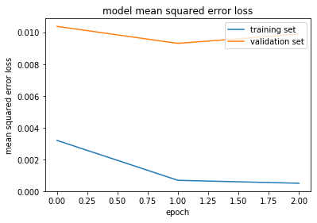

I try to decrease epoch times to 2 to reduce overfitting, the loss value performs good, but when I use this model in Autonomous mode, the vehicle fell off the track. The loss value of training and validation shows below, and the image of vehicle fell off the track shows below too.
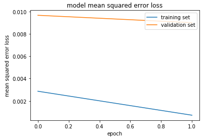
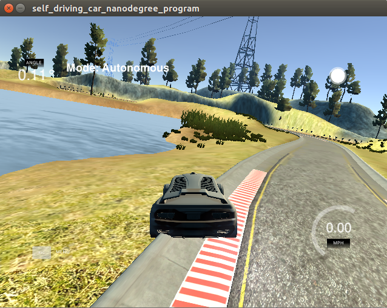

Because of previously experiments, I add the dropout unit to reduce the overfitting. The loss value of the trainin gand validation shows dropout unit reduce the overfitting, but the testin result didn't shows well, result of using `epoch = 3, without dropout` are more better then `[epoch = 3, with dropout` . The loss value of the training and validation graphy shown below.
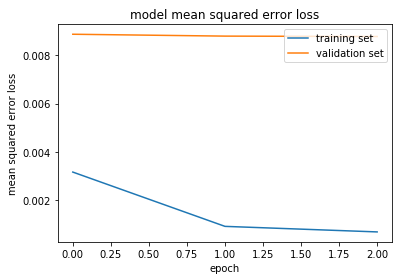


####3. Model parameter tuning

The model used an adam optimizer, so the learning rate was not tuned manually, `model.compile(loss='mse', optimizer='adam')` (Convolution neural network block of `model2.py`).

####4. Appropriate training data

Training data was chosen to keep the vehicle driving on the road. I just used center lane driving, except the dataset which are given by Udacity, I created 4890 training dataset depends on the performance of vehicle in autonomous mode. For example, because of the bad performance of vehicle when met curve road, I creat training dataset again in every curve road. 

For details about how I created the training data, see the next section. 

###Model Architecture and Training Strategy

####1. Solution Design Approach

The overall strategy for deriving a model architecture was to teach the vehicle drive by itself based on the training model which make by me.

My first step was to use a opencv function to flip the image to augment more dataset.

In order to gauge how well the model was working, I split my image and steering angle data into a training and validation set. In my 3 epoch, the loss of training and validation keep low, so it means my model didn't overfitting.

When I use `cv2.imshow()`, I found the program read images use `BGR` format, I'm not sure the autonomous mode will read image using `RGB` or `BGR`, so I just try use `cv2.cvt()` convert BGR image to RGB, it show better performance in autonomous mode.

The final step was to run the simulator to see how well the car was driving around track one. There were a few spots where the vehicle fell off the track. To improve the driving behavior in these cases, these cases including straight line, curve line and turn right curve line. First time I run the simulator, the vehicle will fell off the track even in straight line, I think it becuase of lack of dataset, I just got about 2000 image to train, althought I got small loss value both of training and validation step. After collecting dataset of one full track and combine that with udacity's dataset, vehicle can work well in straight, but still will fell off the track when met curve line, so I created about 4000 training dataset in every curve lanes and focus on the place where the vehicle easy fell off the track. After that vehicle can run well in most of curve line, but it still fell off the track when met turn right curve line, so I created about 800 training dataset in that turn right curve line. Becuase in simulator, most of curves are turn left, so when the vehicle met turn right curve line, the performance will decrease.

At the end of the process, the vehicle is able to drive autonomously around the track without leaving the road.

####2. Final Model Architecture

The final model architecture ( Convolution neural network part of  `model2.py`) consisted of a convolution neural network with the following layers and layer sizes.

I used NVIDIA architecture which has been introduced in Udacity's lesson, this architecture more powerful than Lynette. and the image I shown below is the screenshot of Udacity's lesson's video. The network consists of a normalization layer (`model.add(Lambda(lambda x: (x/127.5) - 1., input_shape=(160,320,3)))`), five convolutional layer (Kernel size 5 by 5 and 3 by 3). The architecture image, starting from the bottom (input),


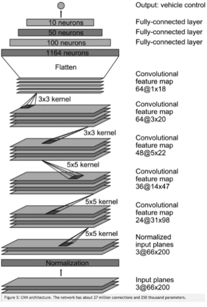

####3. Creation of the Training Set & Training Process
I use two dataset source, one is from udacity, another I create by myself.

To capture good driving behavior, I first recorded two laps on track one using center lane driving. Here is an example image of center lane driving:

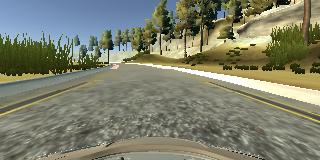

I then recorded the vehicle recovering from the left side and right sides of the road back to center so that the vehicle would learn to how to back to the center when run too left or too right on the road. These images show when vehicle on the left side and right side of the road. 

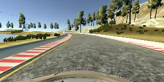
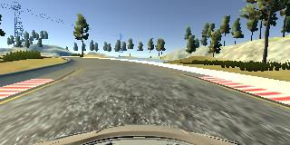
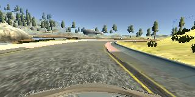

Then I repeated this process on all of the curve line part in order to get more data points, and because vehicle in autonomous mode always fell off the track.

To augment the data set, I also flipped images and angles thinking that this would make more dataset and also can balance dataset because of curve lane. For example, here is an image that has then been flipped:

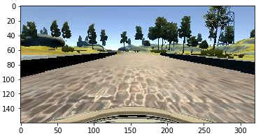
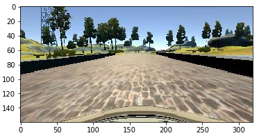

I finally randomly shuffled the data set and put 20% of the data into a validation set. 

I used this training data for training the model. The validation set helped determine if the model was over or under fitting. The ideal number of epochs was 3 as evidenced by the loss value (which i already prove in tpoic 2.Attempts to reduce overfitting in the model.). I used an adam optimizer so that manually training the learning rate wasn't necessary.
